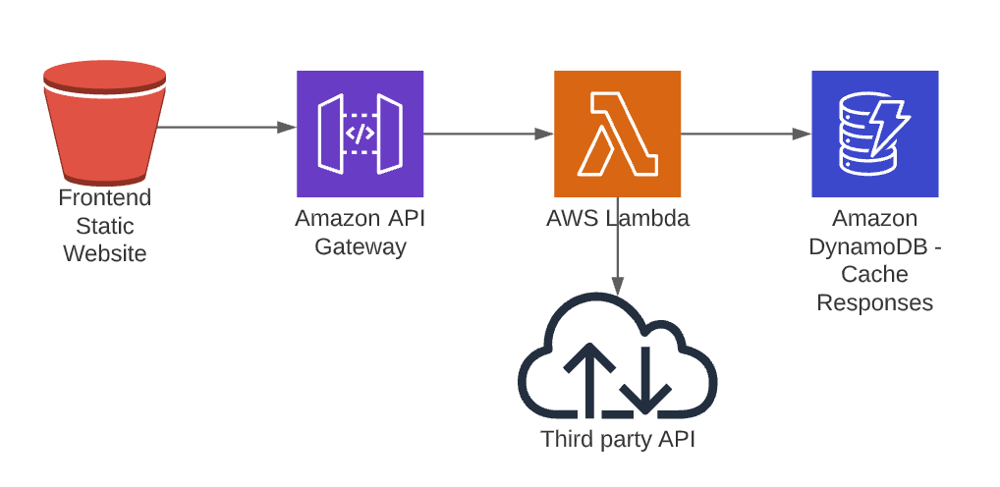
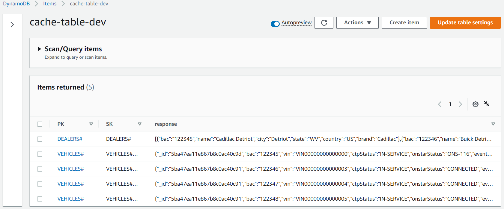

# Demo Vehicles

In this code test, you are required to write a simple application including frontend and backend. 

## Background

We are a software vendor who produces SaaS for the vehicle dealers in US.
Each dealer would have a dealer ID called BAC, a dealer name, e.g., Buick New York, and some staffs.
Every morning, when a dealer staff comes into the shop, he/she will login to the system, see the list of dealers, select one of them and check the vehicle inventory.

You are assigned a task to:

1.  Display a list of dealers in a dashboard, including brand, bac, name, city, state and country.
2.  Each of the dealer item should be clickable. Upon the click, redirect the user to a list of vehicle page. The vehicle list page should display: bac, vin, ctpStatus, onstarStatus, create time, color, stockNumber and year.

### Endpoints:
- `GET - https://bb61co4l22.execute-api.us-west-2.amazonaws.com/development/dealers`
for get list of dealers

- `GET - https://bb61co4l22.execute-api.us-west-2.amazonaws.com/development/vehicles/{bac}`
for get vehicles under one dealer (you should be able to get the bac number from `/dealers` api)

### Note:
- A dealer can have multiple vehicles
- A vehicle can only belongs to 1 dealer, their brands has to match (e.g. Cadillac only have Cadillac vehicles, no Buick allowed)
- Each dealer has a unique bac code to identify themselves.
- Not all the http requests will be successful (sometimes it will have 500 Internal Server error). You need to make sure the user experience is not compromised in those cases.

## Requirements:
- Using git to manage code.
- The frontend should be accessible through Internet.
- Don't replace the endpoints with your own, try to call them.
- TDD development methodology.
- Communicate with us if you have any question.

## Deliverables
- Source code url
- Website url
- API urls
- Any other docs showing your design/thinking/implementation

## Hints:
- Using bootstrap and modern frontend framework to quickly prototype the frontend
- Having your own backend would be very efficient when it comes to scaling, error handling and CORS issues.
- It would be so much easier using a PaaS e.g. Heroku, AWS elasticbenstalk
- Use as much of open source library as you can.
- As an end user, I want to see data, not errors.

### Bonus points:
- Built in CI/CD process
- Well structured code
- Use of Cloud platforms (AWS is preferred)
- Serverless / Microservice infrustructrue
- Nodejs stack

## Solution
- Source code url: https://github.com/kevinvu184/VehiclesDealership
- Website url: http://frontendstack-websitebucket75c24d94-1lijyppqc7e3g.s3-website-ap-southeast-2.amazonaws.com/
- API urls:
  - **wrapper**: `GET - https://cy30854e9g.execute-api.ap-southeast-2.amazonaws.com/dealers`
for get list of dealers
  - **wrapper**: `GET - https://cy30854e9g.execute-api.ap-southeast-2.amazonaws.com/vehicles/{bac}`
for get vehicles under one dealer

### Documentation
#### Architecture
The frontend is a static website hosted in AWS S3, which is connected with the AWS serverless backend. The backend contains logic to handle unexpected 500 errors.

#### Error Handling Solution
- Mechanism 1: Asynchorous retry to the third party API
  - Tradeoff: put heavy load to the third party API -> API enforces limit/quota/cost
- Mechanism 2: Caching the success responses to a DynamoDB table
  - Tradeoff: the case when the database haven't had the cache -> the user experience is compromised
#### Improvement
- Route53 + CloudFront ([Link](https://github.com/aws-samples/aws-cdk-examples/blob/master/typescript/static-site/static-site.ts))
- TDD  - Jest
#### Technology
- Frontend: 
  - HTML/CSS/JS + Bootstrap
  - Typescript + AWS CDK
- Backend:
  - Typescript + AWS SDK v3
  - YML + Serverless
- CICD:
  - GitHub Actions
  - Unit Test, Lint, Format
- Test:
  - Unit test
  - Jest, Mocking